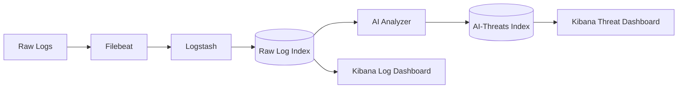
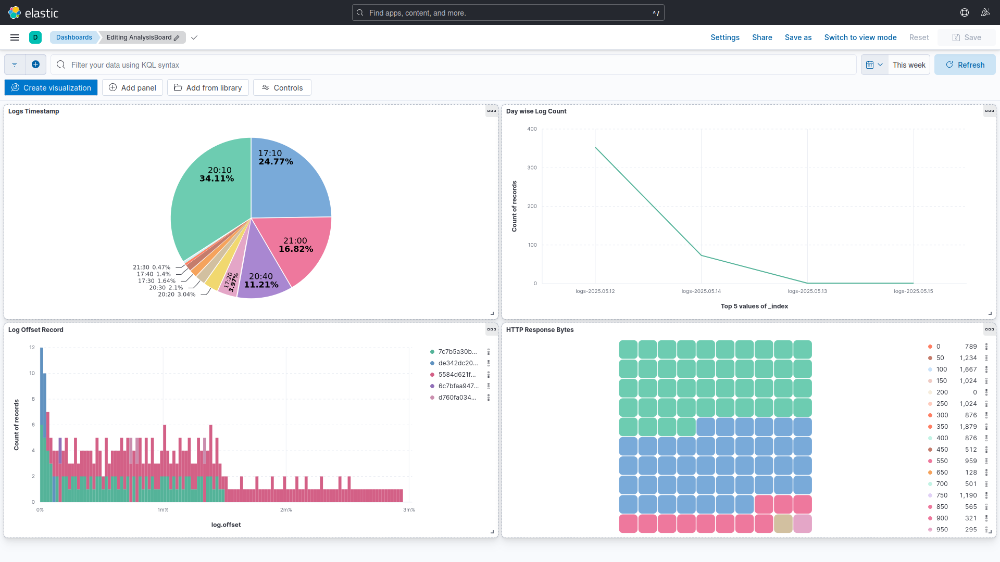

# 🛡️ AI-Powered Threat Detection System


**Next-gen security monitoring** that combines the power of **ELK Stack** with **AI analysis** using Ollama's model to detect threats in real-time. Like a cybersecurity guard dog 🐕 with a PhD in machine learning! 

## ✨ Key Features

| Feature | Benefit |
|---------|---------|
| **🧠 AI-Powered Analysis** | Uses Phi-3-mini/TinyLLaMA models for accurate threat classification |
| **⏱️ Real-time Processing** | Detects threats as they happen (not after the breach!) |
| **📊 Threat Dashboard** | Beautiful Kibana visualizations with threat heatmaps |
| **🔌 Multi-source Support** | Works with Nginx, Apache, system logs, and more |
| **⚙️ Customizable Rules** | Teach it to recognize new threats in 5 minutes |

## 🏗️ System Architecture



## 📜 Log Feed (Raw Logs)

**📍 Location:** Elasticsearch indices matching pattern `logs-*`

### ⚙️ Kibana Configuration

1. Create index pattern: `logs-*`, Time field: `@timestamp`
2. Create index pattern: `ai-threats`, Time field: `@timestamp`


## 🤖 AI-Threat Feed (Analyzed Threats)

**📍 Location:** Elasticsearch index `ai-threats`

### 🧾 Sample Document Structure

```json
{
  "@timestamp": "2025-05-15T12:00:05Z",
  "log": "POST /wp-login.php HTTP/1.1 401 532",
  "source_ip": "192.168.1.100",
  "threat": "brute_force",
  "confidence": 92,
  "evidence": "Multiple rapid POST requests to login endpoint",
  "recommendation": "Implement rate limiting and CAPTCHA",
  "analysis_timestamp": "2025-05-15T12:00:10Z"
}
```

## 🔍 Feed Comparison

| 🧩 Feature           | 📜 Log Feed         | 🤖 AI-Threat Feed               |
| -------------------- | ------------------- | ------------------------------- |
| **Content**          | Raw log data 🗒️    | Analyzed threats 🚨             |
| **Index Pattern**    | `logs-*` 📁         | `ai-threats` 🧠                 |
| **Update Frequency** | Real-time ⚡         | Near-real-time (5–10s delay) ⏱️ |
| **Primary Use**      | Troubleshooting 🛠️ | Threat detection 🛡️            |
| **Data Volume**      | High 📈             | Lower (only threats) 📉         |

## 🔗 Accessing the Feeds

### 1. 🧭 Via Kibana

* **Log Feed**: `Discover → logs-*` 🔍
* **AI-Threat Feed**: `Discover → ai-threats` 🧠

### 2. 💻 Via API

```bash
# 🗒️ Get raw logs
curl "http://localhost:9200/logs-*/_search?q=tags:security&pretty"

# 🚨 Get analyzed threats
curl "http://localhost:9200/ai-threats/_search?q=threat:brute_force&pretty"
```

## 🖥️ Using the Dashboard

1. **Access Kibana** at `http://localhost:5601`  
   

2. **Recommended Visualizations**:
   - 🍕 Threat Type Pie Chart
   - 📈 Confidence Level Histogram
   - 🕰️ Events Timeline
   - 🗺️ Threat Origin World Map

## 🚀 Getting Started

### Prerequisites

- Docker 🐳 20.10+
- Docker Compose 🎭
- Python 🐍
- Hardware: 
  - **Recommended**: 16GB RAM, 8 cores (for AI analysis)  
  - Storage: 20GB SSD (for log retention)

### Installation

1. **Clone the repo**  
   ```bash
   git clone https://github.com/virtualISP/AI-Powered-Threat-Detection-System.git
   cd AI-Powered-Threat-Detection-System
   ```

2. **Download AI model** (takes 2-5 minutes)  
   ```bash
   docker-compose up ollama && docker exec -it ollama ollama pull phi3:mini
   ```

3. **Launch the system**  
   ```bash
   docker-compose up --build -d
   ```

4. **Verify services**  
   ```bash
   docker-compose ps
   ```

## ⚙️ Configuration Guide

### 🔧 Key Files

| File | Purpose | Icon |
|------|---------|------|
| `docker-compose.yml` | Main service configuration | 🐋 |
| `filebeat/filebeat.yml` | Log collection settings | 📡 |
| `logstash/pipeline/*.conf` | Log processing pipelines | ⚙️ |
| `analyzer.py` | AI analysis brain | 🧠 |


## 🧪 Testing Your Setup

Try these test logs (run in terminal):

```bash
# SQL Injection 🪓
curl -X POST "http://localhost:9200/logs-*/_doc" -H 'Content-Type: application/json' -d'
{
  "@timestamp": "'$(date -u +"%Y-%m-%dT%H:%M:%SZ")'",
  "message": "GET /products?id=1%20UNION%20SELECT%20*%20FROM%20users--"
}'

# Brute Force 🔑
curl -X POST "http://localhost:9200/logs-*/_doc" -H 'Content-Type: application/json' -d'
{
  "@timestamp": "'$(date -u +"%Y-%m-%dT%H:%M:%SZ")'",
  "message": "10 failed SSH attempts for root from 45.33.21.10"
}'
```

## 🚨 Troubleshooting

| Symptom | Fix |
|---------|-----|
| Ollama model not loading 🐘 | Increase memory in `docker-compose.yml` |
| Kibana shows no data 🕵️ | Check index pattern matches `ai-threats` |
| High CPU usage 🔥 | Reduce `POLL_INTERVAL` or switch to `tinyllama` |

**Pro Tip**: Monitor system health with:
```bash
watch -n 1 'docker stats --no-stream'
```

## 🤝 How to Contribute
1. Fork the repository
2. Create your feature branch (`git checkout -b cool-new-feature`)
3. Commit changes (`git commit -m 'Add some feature'`)
4. Push to branch (`git push origin cool-new-feature`)
5. Open a Pull Request

## 📜 License
MIT © VirtualISP – **[⚖️ See LICENSE](resources/LICENSE)**

---

**Happy Threat Hunting!** 👾🔍 
*"Sleep better knowing your logs are being watched by AI"*

